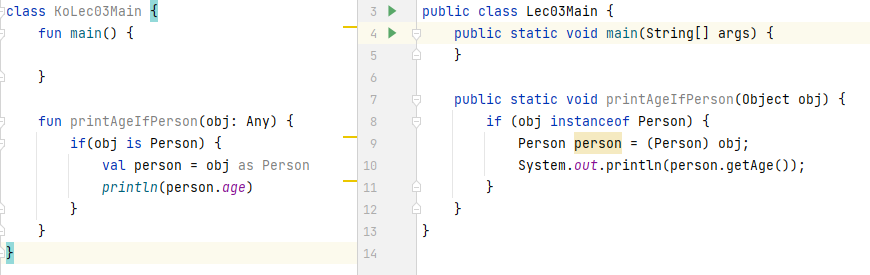

# Lec03 - 코틀린에서 Type을 다루는 방법
## 1. 기본 타입
자바와 동일하게 코틀린에서도 기본 타입 8가지(Byte, Short, Int, Long, Float, Double, Char, Boolean)를 제공한다. 그 중 가장 많이 쓰이는 
Int,Long, Float, Double을 중점적으로 살펴보자.
```kotlin
val num1 = 3    // Int
val num2 = 3L   // Long

val num3 = 3.0f // float
val num4 = 3.0  // Double
```
코틀린은 위 예시처럼 선언된 기본값을 보고 타입을 추론되기 때문에 타입을 항상 명시해줘야 했던 자바와 차이점을 가진다. 또한, 자바에서는 기본 타입간의
형변환을 암시적으로 이루어질 수 있다.
```java
int num1 = 3; 
double num2 = num1;  // 형변환 
```
이와 달리 코틀린에서는 기본 타입간의 형변환을 명시적으로 이루어져야 한다.
```kotlin
val num1 = 4
val num2: Long = num1  // Type mismatch

val num1: Int = 4
val num2: Long = num1.toLong()   // 명시적인 형변환

val num1 = 3
val num2 = 2
val result = num1/num2.toDouble()   // 명시적 형변환의 예시
```
위 처럼 명시적 형변환이 강제됨으로써 타입 오류로 인한 결과값의 오차를 줄일 수 있다.

#### 💡nullable 변수일 경우
```kotlin
val num1: Int? = 3    
val num2: Long = num1.toLong()   // 컴파일 에러 발생!
```
위 처럼 변수가 nullable일 경우 명시적을 형변환을 하더라도 에러가 발생한다. 이때는 safe call과 엘비스 연산자를 사용해야 한다.
```kotlin
val num1: Int? = 3    
val num2: Long = num1?.toLong() ?: 0L
```
## 2. 타입 캐스팅
일반 타입의 경우 어떻게 캐스팅을 할까? 자바에서는 아래와 같이 `instance of`를 통해 해당 객체가 형변환이 되는지에 대한 여부를 확인하였다.
```java
public static void printAgeIfPerson(Object obj) {
        if (obj instanceof Person) {
            Person person = (Person) obj;
            System.out.println(person.getAge());
        }
    }
```
코틀린에서 해당 코드를 작성하기 위해서는 `instance of`를 대신하는 것을 알아야 한다. 
코틀린은 `is`를 통해 해당 객체가 형변환이 가능한지에 대한 여부를 묻는다. 개인적으로 자바의 `instance of`보다 직관적이라고 생각한다.
```kotlin
// 자바 : if (obj instanceof Person) {}
if(obj is Person) {}
```
자바에서는 형변환을 위해 `(Person)`을 통해 명시적 형변환을 해주었지만 코틀린에서는 `as`키워드를 사용한다.
```kotlin
// 자바 : Person person = (Person) obj
val person = obj as Person
```
 
변경된 코드를 한눈에 확인하면 코틀린이 조금 더 간결하고 직관적인 것을 알 수 있다.

또한, 코틀린의 코드는 생략이 가능한 부분이 있다. `obj as Person`에서 `as Person`는 생략하여 쓸 수 있음으로 아래와 같이 작성할 수 있다. 
이를 **스마트 캐스트**라고 한다.
```kotlin
fun printAgeIfPerson(obj: Any) {
        if(obj is Person) {
            println(obj.age)
        }
    }
```
`is`의 반대 즉, 뭐뭐가 아니라면에 대한 조건을 걸고 싶으면 `!is`를 사용하면 된다.
```kotlin
if(obj !is Person) {}
```
#### 💡obj가 null이라면?
```kotlin
fun printAgeIfPerson(obj: Any?) {
        val person = obj as? Person // as?를 통해 obj가 null이 아니라면 Person으로 형변환
        println(person.age)
    }
```
만약 obj에 null이 들어가게 된다면 `as?`를 통해 person에 null값이 담기게 된다. 따라서 person의 타입 역시 Person? 타입인 것을 알 수 있다.
현재와 같이 코드를 작성하면 `println(person.age)`에서 컴파일 에러가 발생하는데 person의 타입이 nullable이기 때문이며 `println(person?.age`로 수정하여 사용한다.

## 3. Kotlin의 3가지 특이한 타입
### Any

- Java의 Object 역할이며, 모든 객체의 최상위 타입이다.
- 모든 Primitive Type의 최상의 타입
- `Any`는 non nullable이기 때문에 null을 허용하려면 `Any?`를 사용해야 한다.
- `Any`에는 `equals()`, `hashCode()`, `toString()`이 존재한다.

### Unit

- Java의 void와 동일한 역할 (코틀린의 타입추론으로 생략 가능)
- void와 다르게 Unit은 그 자체로 타입 인자로 사용 가능
- 함수형 프로그래밍에서 Unit은 단 하나의 인스턴스만 갖는 타입, 코틀린의 Unit은 실제 존재하는 타입이라는 것을 표현

### Nothing

- 함수가 정상적으로 끝나지 않았다는 사실을 표현하는 역할
- 무조건 예외를 반환하는 함수/무한 루프 함수 등
```kotlin
fun fail(message: String): Nothing {
    throw IllegalArgumentException(message)
}
```

## 4. String Interpolation, String Indexing
코틀린은 `${변수}`를 통해 String을 출력할 수 있다. 다만 이 방법은 코틀린 공식 문서에서 간단한 변수에만 사용하는 것을 권장하고 있다.
```kotlin
val person = Person("나혜리", "30")
val log = "사람의 이름은 ${person.name}이고 나이는 ${person.age}세 입니다."
```

### 여러 줄의 문자 
큰 따옴표(") 3개를 사용하면 여러 줄의 문자를 자유롭게 작성할 수 있다.
```kotlin
fun main() {
    var str = """
            어쩌구 저쩌구
            이러쿵 저러쿵
        """.trimIndent() // trim 제거
}
```

### 문자에서 특정 문자만 가져오는 법
#### Java
```java
String str = "abcde";
char ch = str.charAt(1);
```

#### Kotlin
```kotlin
val str = "abcde"
val ch = str[1]
```
