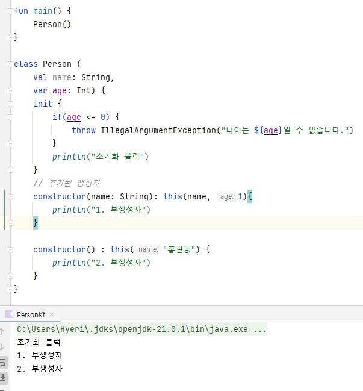

# Lec09 - 코틀린에서 클래스 다루는 방법
## 클래스와 프로퍼티
상수인 `name`과 변수인 `age`를 가진 Person 클래스를 작성해보자.
```java
// Java
public class JavaPerson {
    private final String name;
    private int age;

    public String getName() {
        return name;
    }

    public int getAge() {
        return age;
    }

    public void setAge(int age) {
        this.age = age;
    }
}
```
Java는 위 코드와 같이 작성하며, 해당 변수에 값을 부여하기 위해 getter, setter를 추가적으로 작성해줘야 한다. 

**프로퍼티** : 필드 + getter + setter

Kotlin에서는 위와 같은 코드를 아래와 같이 작성할 수 있다.
```kotlin
class Person constructor(name: String, age: Int) { 
    val name = name
    val age = age
}
```
kotlin은 Java와 달리 필드 변수만 작성하고 getter, setter를 별도로 작성할 필요없이 자체적으로 생성해준다. 또한 필드 변수가 `var`키워드를 
가졌다면 getter, setter를 둘 다 생성해주고, `val`키워드를 가진 상수일 경우에는 getter만 생성해준다. 

그리고 Kotlin에서는 생성자를 가르키는 `constructor`를 생략하여 사용할 수 있으며, 생성자 선언과 동시에 필드 변수를 선언할 수 있다.
```kotlin
class Person (val name: String,  var age: Int) // {메서드 바디}에 내용이 없으면 중괄호 생략이 가능
```
Java에서는 getter/setter를 사용할 때 `person.getAge()`, `person.setAge()`로 사용하였으나, kotlin에서는 `.필드`를 통해 getter/setter를
바로 호출할 수 있다.
```kotlin
fun main() {
    val person = Person("나혜리", 20)
    println(person.name)
    
    person.age = 19
    println(person.age)
}
```
Java의 클래스로 만들어진 객체라 하더라고 Kotlin 코드에서 위와 같은 방식으로 getter/setter를 사용할 수 있다.
## 생성자와 init
생성자를 통해 필드 변수에 값을 넣을 때 해당 값에 대한 검증이 필요하다면 Java는 아래와 같이 작성할 수 있다.
```java
public JavaPerson(String name, int age) {
        if (age <= 0) {
            throw new IllegalArgumentException(String.format("나이는 %s일 수 없습니다", age));
        }
        this.name = name;
        this.age = age;
    }
```
그렇다면 Kotlin에서는 어떤 방식을 사용할까? 바로 `init` 함수를 사용한다.
```kotlin
class Person (
    val name: String,
    var age: Int) {
    init {
        if(age <= 0) {
            throw IllegalArgumentException("나이는 ${age}일 수 없습니다.")
        }
    }
}
```
`init`함수는 초기화 블록이며 생성자가 호출되는 시점에 호출되며 값을 적절히 만들어주거나, validation하는 로직에 사용된다.

만약, 생성자가 하나 더 필요하다면 Java와 Kotlin 코드는 각각 어떻게 작성될까
```java
// Java
public class JavaPerson {
    private final String name;
    private int age;

    public JavaPerson(String name, int age) {
        if (age <= 0) {
            throw new IllegalArgumentException(String.format("나이는 %s일 수 없습니다", age));
        }
        this.name = name;
        this.age = age;
    }

    // 추가된 생성자
    public JavaPerson(String name) {
        this(name, 1);
    }
}
```
```kotlin
// kotlin
class Person (           
    val name: String,
    var age: Int) {
    init {
        if(age <= 0) {
            throw IllegalArgumentException("나이는 ${age}일 수 없습니다.")
        }
    }
    // 추가된 생성자
    constructor(name: String): this(name, 1)
}
```
위 처럼 `(val name: String, var age: Int)`를 주 생성자라고 하며 반드시 존재해야 한다. 만약에 주 생성자에 파라미터가 하나도 없는 경우에만 
기본 생성자가 제공되어 생성자 없이 사용할 수 있다.

그리고 추가된 생성자 `constructor(name: String): this(name, 1)`를 부 생성자라고 하며 필수적이지 않고 필요에 따라 생성한다. 부 생성자는
최종적으로 주 생성자를 `this`로 호출해야 하며 body를 가질 수 있다.
```kotlin
constructor(name: String): this(name, 1){
        println("1. 부생성자")
    }

constructor() : this("홍길동") {
        println("2. 부생성자")
    }
```
그렇다면 생성자의 호출 순서는 어떻게 될까?
```kotlin
fun main() {
    Person()
}

class Person (
    val name: String,
    var age: Int) {
    init {
        if(age <= 0) {
            throw IllegalArgumentException("나이는 ${age}일 수 없습니다.")
        }
        println("초기화 블럭")
    }
    // 추가된 생성자
    constructor(name: String): this(name, 1){
        println("1. 부생성자")
    }

    constructor() : this("홍길동") {
        println("2. 부생성자")
    }
}
```
위와 같이 2번째 부생성자를 호출하는 객체를 만들어 실행해보면 아래와 같이 역순으로 실행됨을 알 수 있다.


> 하지만 Kotlin에서는 부생성자의 사용보다는 **default parameter** 사용을 권장하고 있다.
## 커스텀 getter, setter
성인인지 아닌지 확인하는 함수가 있다면 java 코드로 아래와 같이 작성할 수 있다.
```java
public boolean isAdult() {
        return this.age >= 20;
    }
```
Kotlin에서도 같은 방식의 함수를 아래와 같이 작성할 수 있다.
```kotlin
fun isAdult(): Boolean {
        return this.age >= 20
    }
```
하지만 Kotlin에서는 위와 같은 함수를 프로퍼티로서 사용할 수 있으며 이를 **커스텀 getter/setter** 라고 한다.
```kotlin
val isAdult: Boolean
    get() = this.age >= 50
```
해당 필드 변수를 불러왔을 때(get했을 때) 해당 식을 실행하는 것이다.

> **커스텀 getter/setter**는 객체의 속성을 확인할 때 사용하는 것을 권장하고, 그 외의 경우에는 함수를 사용하는 것을 권장한다.


## backing field
**커스텀 getter**를 사용하면 자기 자신을 변형해 줄 수도 있다. `name`이라는 값을 받을 때, 대문자로 변환해서 저장될 수 있도록 로직을 작성하면 아래와 같다.
```kotlin
class Person (
    name: String,         // getter를 커스터마이징하기 위해 val를 지워준다.
    var age: Int) {

    val name = name
        get() = name.uppercase()  // 오류 발생
    
}
```
하지만 위와 같이 쓰면 `val name = name`에서 컴파일 오류가 발생하게 된다. 그 이유는 `get() = name.uppercase()`에서 **name**를 사용했기 때문이며
이를 **field**로 변경하면 오류가 발생하지 않는다.
```kotlin
val name = name
    get() = field.uppercase()
```
그 이유는 해당 코드에서 `.name`를 호출하면 getter가 호출되기 때문이다. 이게 왜 문제가 되냐..싶겠지만 커스텀 getter를 생성해놨기 때문에 끝없이
해당 getter를 호출하여 무한루프가 발생한다.
```kotlin
// 첫 호출
val name = name
    get() = name.uppercase() // getter 호출~
// 2번째 호출
get() = name.uppercase() // getter 호출~
// N번째 호출
get() = name.uppercase() // getter 호출~
``` 
이러한 무한 루프를 막기 위해 예약어인 **field**를 사용하고 이는 자기 자신을 의미한다. 이것을 **backing field**라고 한다.

**커스텀 Setter**는 아래와 같이 사용한다.
```kotlin
class Person (
    name: String,
    var age: Int) {

    var name = name
        set(value) {
            field = value.uppercase()
        }
}
```
> Java에서 그렇듯 Kotlin에서도 Setter 자체를 지양하기 때문에 커스텀 Setter도 잘 사용하지 않는다.